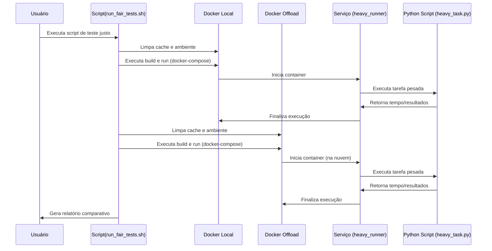

# Docker Offload Performance Tests

Este projeto implementa uma metodologia justa para comparar a performance entre Docker Local e Docker Offload (Build Cloud), eliminando interferências de cache e garantindo condições equivalentes.


## 🎯 Objetivo

Realizar uma comparação **verdadeiramente justa** entre:
- **Docker Local**: Execução em hardware local sem offload
- **Docker Offload**: Execução na nuvem usando Docker Build Cloud

## 🚀 Execução dos Testes

Para executar os testes, utilize o script `run_fair_tests.sh` que automatiza todo o processo de limpeza, execução e geração de relatórios.


```bash
./run_fair_tests.sh
```

O script irá:
1. ✅ Limpar todo cache antes dos testes
2. 🏠 Executar teste local (contexto `default`)
3. 🧹 Limpar ambiente entre testes
4. ☁️ Executar teste cloud (contexto `docker-cloud`)
5. 📊 Gerar relatório comparativo


O projeto usa uma tarefa computacional intensiva em Python que executa:
- Operações matemáticas (sin, cos, sqrt)
- Loop de 100 milhões de iterações (configurável)
- Medição precisa de tempo de execução

### Configurar Intensidade
```bash
# No docker-compose.yaml
environment:
  ITERATIONS: "200000000"  # Para teste mais pesado
```

## 🔧 Pré-requisitos

1. **Docker Desktop** com Docker Offload habilitado
2. **Docker Build Cloud** configurado
3. **Python 3** (para verificação local)
4. **bc** para cálculos (já disponível no sistema)

### Verificar Configuração
```bash
# Verificar contextos Docker
docker context ls

# Verificar contexto ativo
docker context show

# Verificar Build Cloud
docker buildx ls
```

## 📊 Resultados Esperados

Com a metodologia justa, esperamos medir:

### **Diferenças Reais**
- 🖥️ Hardware: CPU/RAM cloud vs local
- 🌐 Overhead: Rede e transferência de dados
- ⚡ Otimizações: Runtime Docker otimizado na nuvem
- 🏗️ Build: Performance sem cache para ambos

### **Formato dos Resultados**
- **CSV**: `docs/test_results.csv` com dados brutos
- **Terminal**: Relatório em tempo real com percentuais
- **Comparação**: Diferença percentual automática

## 🎯 Cenários de Uso Ideais

Docker Offload é especialmente vantajoso para:

1. **CPU Intensivo**: Como demonstrado nos testes
2. **Builds Pesados**: Projetos com muitas dependências
3. **Hardware Limitado**: Laptops, VMs, ambientes restritos
4. **Equipes**: Cache compartilhado entre desenvolvedores
5. **CI/CD**: Builds paralelos e escaláveis

## 🚀 Executar Testes Agora

```bash
# Executa testes imediatamente
./run_fair_tests.sh

# Monitora resultados em tempo real
# Arquivos gerados:
# - test_results.csv (dados)
# - Output detalhado no terminal
```

---

Para mais informações sobre Docker Offload, consulte o documento principal `docs/docker-offload.md`.
